# Architecture

---

# 1. System Overview

ChatPDF follows a **distributed RAG-based system architecture** designed for:

- scalable semantic retrieval,
- precise source grounding,
- conversational querying,
- and cloud-native deployment.

The system converts uploaded PDFs into searchable semantic knowledge using:

- **PyMuPDF** for extraction,
- **Gemini Embeddings** for vectorization,
- **pgvector** for retrieval,
- and **Gemini 2.5 Flash** for grounded response generation.

---

# 2. High-Level System Design

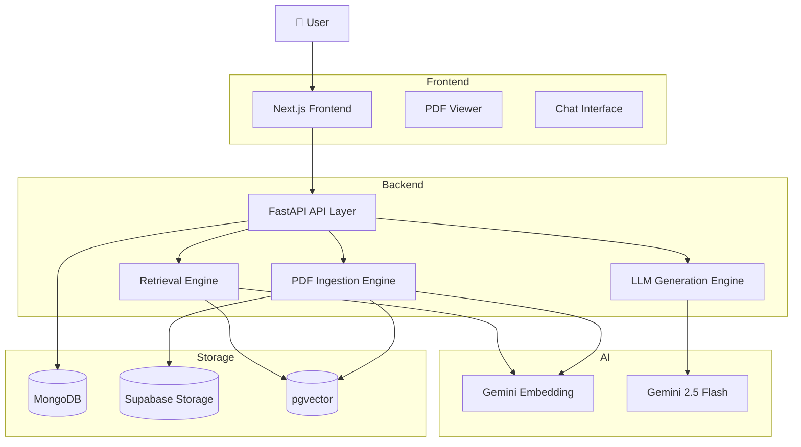

---

# 3. Core System Flow

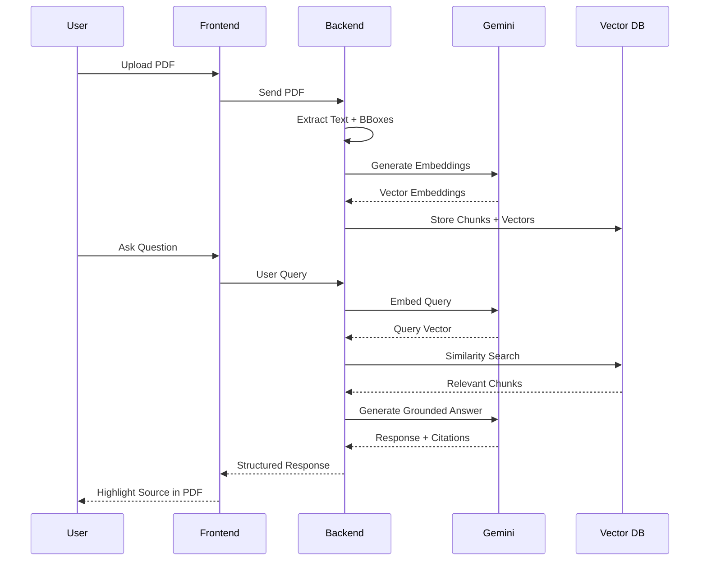

---

# 4. PDF Ingestion Architecture

The ingestion pipeline transforms raw PDFs into semantically retrievable chunks.

## Ingestion Pipeline

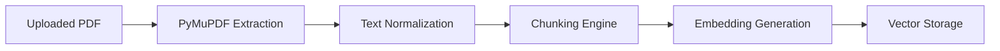

---

# 5. Chunking Strategy

The architecture uses:

- bbox-aware chunking,
- page-isolated segmentation,
- semantic overlap preservation.

## Chunk Formation Logic

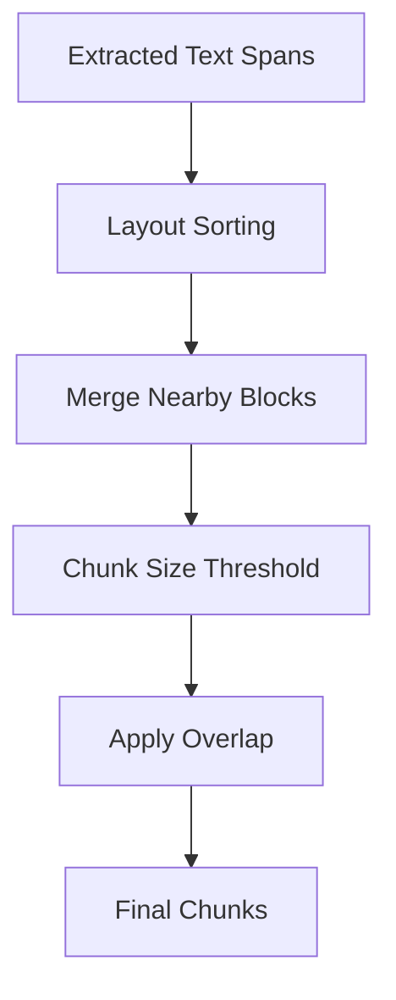

---

# 6. Vector Retrieval Architecture

Semantic retrieval is powered by:

Gemini Embeddings + pgvector cosine similarity

---

## Retrieval Pipeline

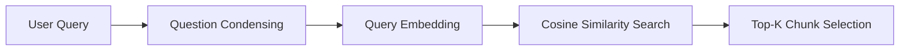

---

# 7. RAG Generation Pipeline

The system follows a strict Retrieval-Augmented Generation workflow.

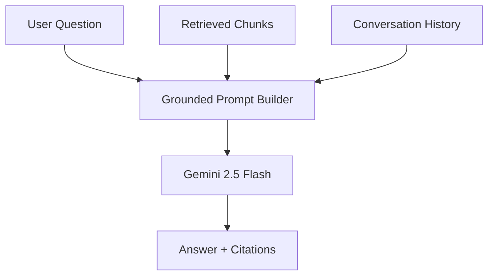

---

# 8. Citation Grounding Architecture

A core differentiator of the system is exact source grounding.

Each chunk stores:

- page number,
- bounding box,
- dimensions,
- source snippet.

---

## Citation Highlight Flow

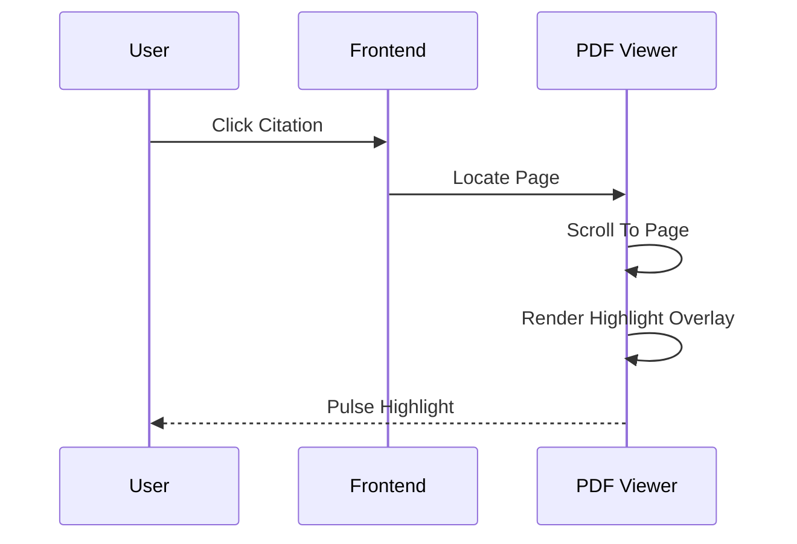

---

# 9. Storage Architecture

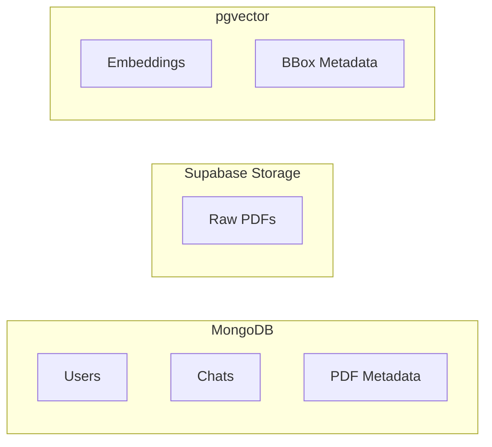

---

# 10. Backend Internal Architecture

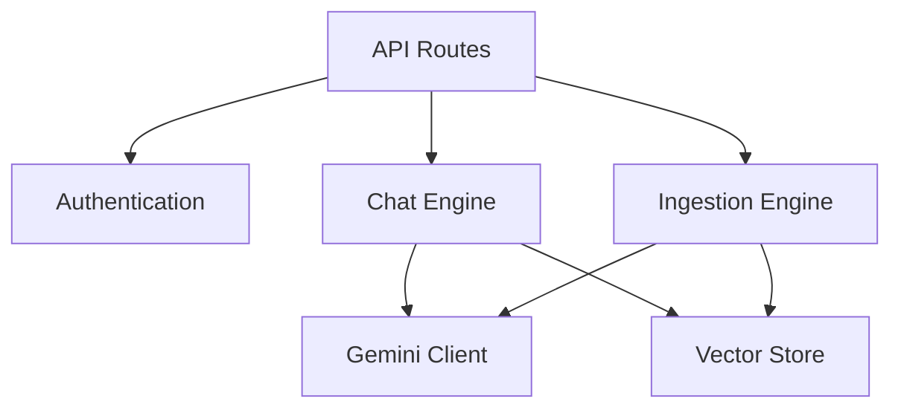

---

# 11. Authentication Flow

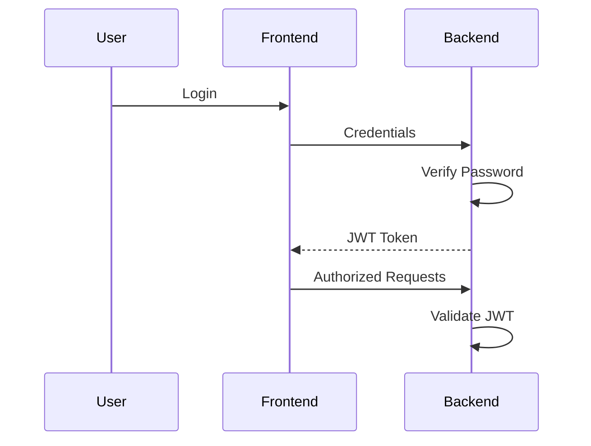

---

# 12. Deployment Architecture

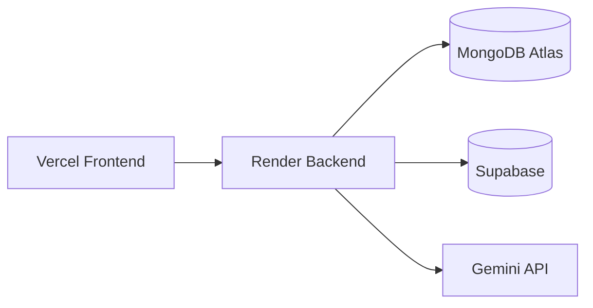

---

# 13. System Design Principles

## Scalability

- stateless backend,
- persistent vector database,
- externalized storage architecture.

---

## Reliability

- retry/backoff embedding architecture,
- persistent cloud storage,
- retrieval fallback mechanisms.

---

## Grounded Generation

- strict context-only answering,
- citation enforcement,
- hallucination refusal pipeline.

---

## Performance

- batched embeddings,
- cosine vector indexing,
- top-k retrieval optimization,
- chunk overlap preservation.

---

# 14. Future Architecture Extensions

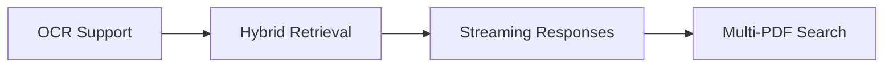

---

# 15. UI Showcase

## Landing Page

  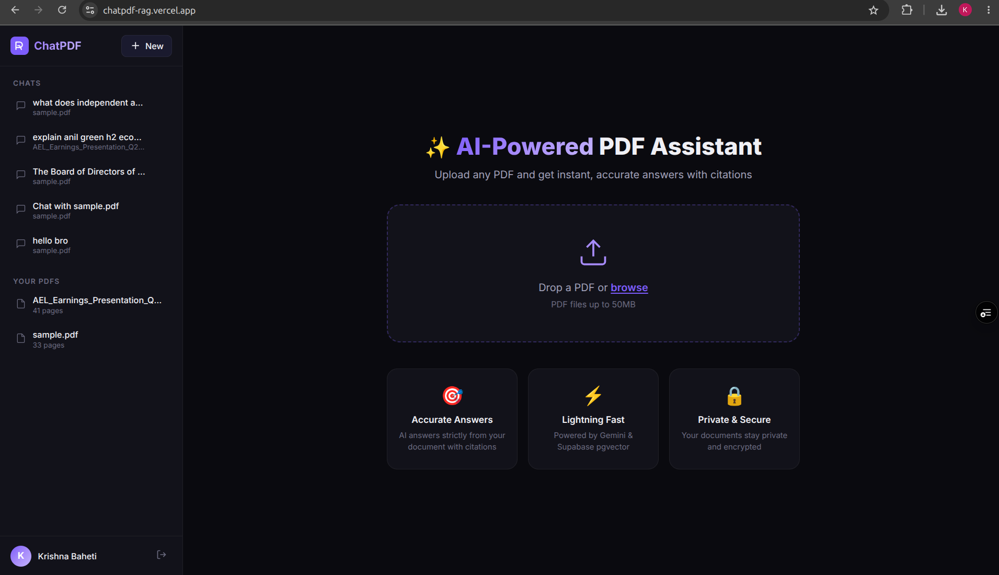

---

## Main Query Interface

  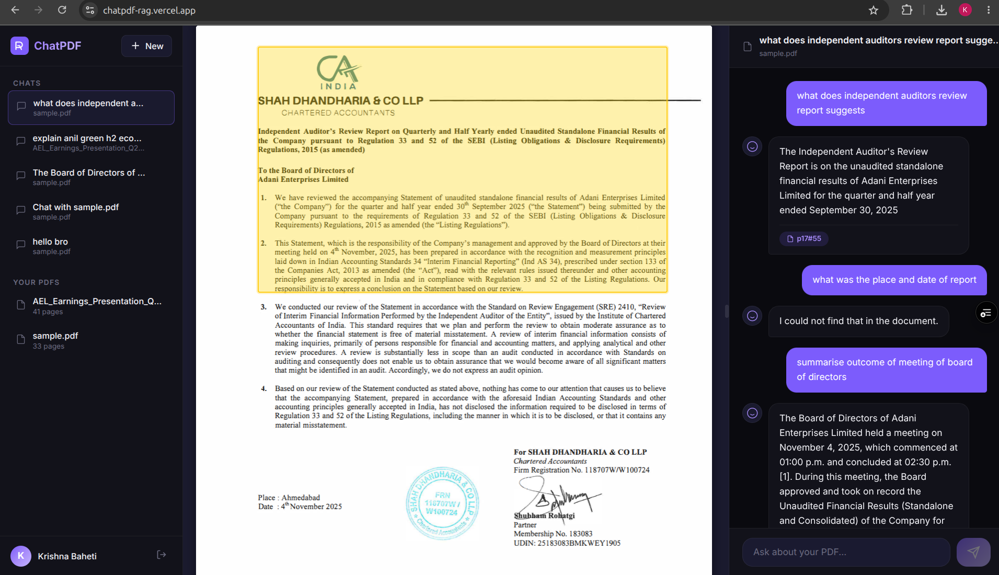

