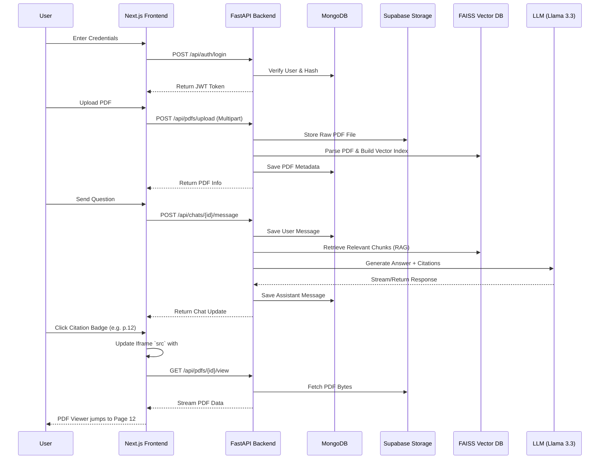

# ChatPDF — AI-Powered Document Assistant

A full-stack, production-ready web application that allows users to upload PDF documents and converse with them using Advanced RAG (Retrieval-Augmented Generation). 

Built with **FastAPI**, **Next.js**, **LlamaIndex**, and **MongoDB**.

---

## 🚀 Features

- **Dynamic Split-View UI**: Read your PDF and chat with the AI side-by-side.
- **Interactive Citations**: Click on AI-generated citations to instantly jump to the exact source page in the PDF viewer.
- **Per-User Isolation**: Secure JWT authentication and isolated vector indexes ensure privacy.
- **Persistent Chat History**: Pick up conversations exactly where you left off.
- **Lightning Fast RAG**: Powered by Llama 3.3 70B and FAISS vector similarity search.

---

## 🏗️ Architecture Flow

The system consists of a Next.js App Router frontend and a FastAPI backend communicating with various external services.



---

## 💻 Tech Stack

### Frontend
- **Framework**: Next.js 14 (App Router)
- **Styling**: Custom CSS Modules with Glassmorphism and CSS animations
- **State**: React Context API
- **PDF Viewer**: Native browser `iframe` integration

### Backend
- **Framework**: FastAPI (Python)
- **Database**: MongoDB (Motor Async Driver)
- **Object Storage**: Supabase
- **AI / RAG**: LlamaIndex, FAISS, LlamaCloud (Parsing), Groq (LLM)
- **Auth**: PyJWT & bcrypt

---

## ⚙️ Getting Started

### Prerequisites
- Node.js >= 18
- Python >= 3.10
- MongoDB instance (e.g., Atlas)
- Supabase Project
- API Keys: Groq, LlamaCloud

### 1. Environment Setup

Create a `.env` file in the `backend/` directory:

```env
# Database
MONGODB_URI=mongodb+srv://<user>:<password>@cluster.mongodb.net
SUPABASE_URL=https://<your-project>.supabase.co
SUPABASE_KEY=<your-anon-key>

# AI API Keys
GROQ_API_KEY=gsk_...
LLAMA_CLOUD_API_KEY=llx-...

# Security
JWT_SECRET_KEY=your-super-secret-key
```

### 2. Start the Backend

```bash
cd backend
python -m venv venv
source venv/bin/activate
pip install -r requirements.txt

# Start the FastAPI server on port 8000
uvicorn main:app --reload --port 8000
```

### 3. Start the Frontend

```bash
cd frontend
npm install

# Start the Next.js development server on port 3000
npm run dev
```

Open [http://localhost:3000](http://localhost:3000) in your browser.
