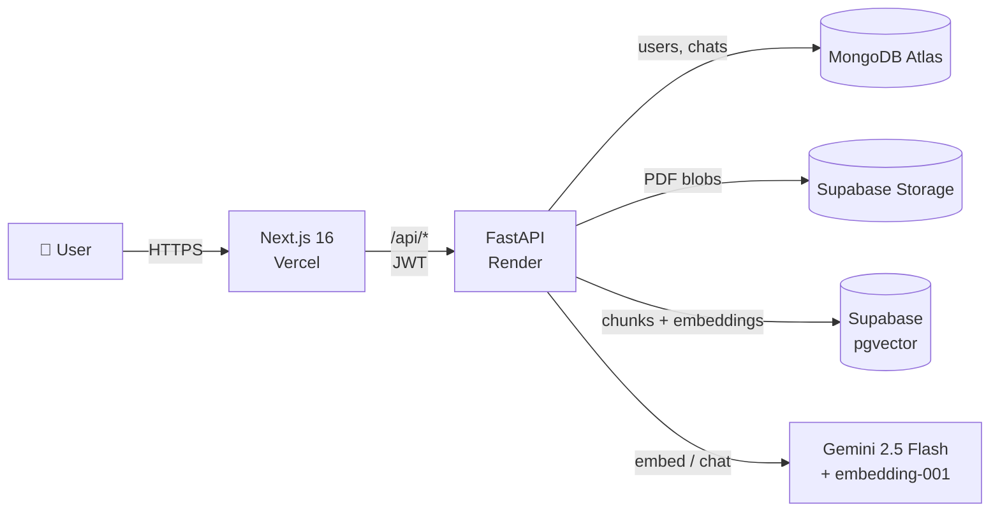
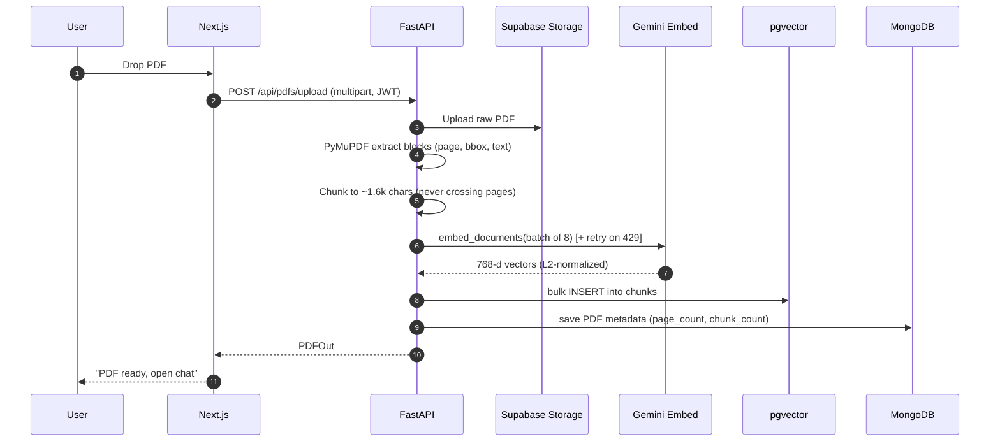
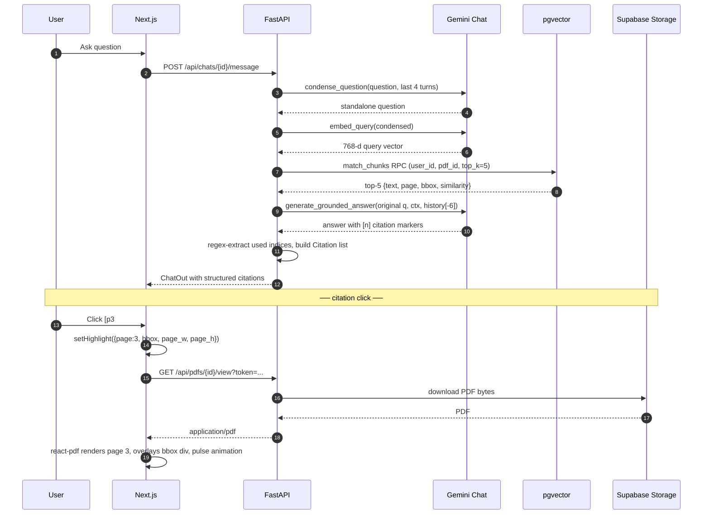

# ChatPDF — AI-Powered Document Assistant

## Landing Page

<p align="center">
  
</p>

<p align="center">
  🚀 Live Website:
  <a href="https://chatpdf-rag.vercel.app/">
    https://chatpdf-rag.vercel.app/
  </a>
</p>

---

## Main Query Interface

<p align="center">
  
</p>

> Upload any text-based PDF and chat with it. Every cited fact links back to the **exact source rectangle** on the **exact page** — clicking a citation scrolls the in-app PDF viewer to that page and pulses a coloured highlight over the source bbox.

Built for the **Powermind Hackathon** with a free-tier-friendly stack: **FastAPI**, **Next.js 16**, **Gemini 2.5 Flash**, **Supabase (Storage + pgvector)**, and **MongoDB Atlas**. Designed to run on Render's free tier (512 MB RAM, ephemeral disk) and Vercel's free tier.

---

## Table of Contents

- [Features](#features)
- [Tech Stack](#tech-stack)
- [Architecture](#architecture)
- [How the RAG Pipeline Works](#how-the-rag-pipeline-works)
- [Acceptance Behaviour](#acceptance-behaviour)
- [Project Structure](#project-structure)
- [Local Development](#local-development)
- [Deployment (Render + Vercel)](#deployment-render--vercel)
- [Environment Variables](#environment-variables)
- [Database Schema](#database-schema)
- [Known Free-Tier Caveats](#known-free-tier-caveats)
- [Troubleshooting](#troubleshooting)
- [Repository Layout (Mirrors)](#repository-layout-mirrors)

---

## Features

|                                     |                                                                                                                                                                                                      |
| ----------------------------------- | ---------------------------------------------------------------------------------------------------------------------------------------------------------------------------------------------------- |
| 🎯 **Generic-PDF RAG**              | PyMuPDF extracts text blocks with per-page bounding boxes. Works on any text-based PDF — contracts, research papers, books, slide decks, financial reports.                                          |
| 📌 **Click-to-highlight citations** | Citations are structured `{page, bbox, snippet}` payloads. The frontend scrolls to the page and paints a translucent rectangle over the exact source.                                                |
| 💾 **Persistent vectors**           | Chunks live in Supabase `pgvector`. Survives Render free-tier restarts. No per-user index directories on disk.                                                                                       |
| 💬 **Conversational memory**        | Last 6 turns of chat history are sent with every question. Follow-ups like _"break that down…"_ are silently **condensed into standalone questions** before retrieval so they pull the right chunks. |
| 🚫 **Honest refusals**              | When the answer isn't in the document the model returns _"I could not find that in the document."_ with **no citations attached** — no fake sources for hallucinated answers.                        |
| 🔁 **Rate-limit-resilient**         | Every Gemini call wraps a 5-attempt exponential-backoff retry that honours the server's `retry in Ns` hint. Free-tier RPM throttles don't break uploads.                                             |
| 🔐 **Per-user isolation**           | JWT auth with bcrypt password hashing. Every pgvector retrieval is scoped to `(user_id, pdf_id)`.                                                                                                    |
| ⚡ **Streaming-ready chat history** | Chats and messages persist in MongoDB so users can resume conversations on any device.                                                                                                               |

---

## Tech Stack

### Frontend

| Layer         | Tool                                                                                                                                                  |
| ------------- | ----------------------------------------------------------------------------------------------------------------------------------------------------- |
| Framework     | **Next.js 16** (App Router, Turbopack)                                                                                                                |
| Runtime       | **React 19**                                                                                                                                          |
| PDF Rendering | [`react-pdf`](https://github.com/wojtekmaj/react-pdf) **10.4.1** (pinned to `pdfjs-dist@5.4.296` to avoid the well-known worker/API version mismatch) |
| Styling       | CSS Modules + custom design tokens (dark theme, glassmorphism)                                                                                        |
| State         | React Context (`AuthContext`) + local state                                                                                                           |
| Deployment    | **Vercel** (free tier)                                                                                                                                |

### Backend

| Layer           | Tool                                                                                                        |
| --------------- | ----------------------------------------------------------------------------------------------------------- |
| Framework       | **FastAPI** + Uvicorn                                                                                       |
| PDF parsing     | **PyMuPDF** (`fitz`) — block-level text with bboxes                                                         |
| LLM SDK         | [`google-genai`](https://github.com/googleapis/python-genai) (supported successor to `google-generativeai`) |
| Chat model      | `gemini-2.5-flash`                                                                                          |
| Embedding model | `gemini-embedding-001` at 768-d (Matryoshka), L2-normalized                                                 |
| Auth            | `python-jose` (JWT, HS256) + `passlib[bcrypt]`                                                              |
| Mongo driver    | `motor` (async)                                                                                             |
| Supabase SDK    | `supabase-py`                                                                                               |
| Deployment      | **Render** (free tier) — `render.yaml` Blueprint                                                            |

### Data Layer

| Service                     | Role                                                              |
| --------------------------- | ----------------------------------------------------------------- |
| **MongoDB Atlas** (M0 free) | Users, chats, messages, PDF metadata                              |
| **Supabase Storage**        | Raw PDF binary files (private bucket, served via short-lived JWT) |
| **Supabase pgvector**       | 768-d chunk embeddings + bbox metadata; IVFFlat cosine index      |

---

## Architecture

### High-level



### Upload flow



### Chat + citation-click flow



---

## How the RAG Pipeline Works

### 1. Ingestion (`backend/ingest.py`)

- `extract_spans()` opens the PDF with PyMuPDF and walks each page calling `page.get_text("blocks")` — returns `(x0, y0, x1, y1, text, block_no, block_type)` tuples. We keep only `block_type == 0` (text, not images).
- Text is normalized: soft hyphens stripped, hyphenated line-breaks rejoined, single newlines collapsed to spaces, paragraph breaks preserved.
- `chunk_spans()` buckets spans by page, sorts top-to-bottom/left-to-right, and merges into ~1.6 k-char chunks with 200-char overlap.
- Chunks **never cross pages** — this keeps each chunk's `(page, bbox)` single-valued so the frontend can highlight a single rectangle.
- Each chunk's bbox is the **union** of the bboxes of its constituent spans (`_union_bbox`).

### 2. Embedding (`backend/gemini_client.py`)

- `gemini-embedding-001` is called with `task_type=RETRIEVAL_DOCUMENT` and `output_dimensionality=768` (Matryoshka truncation).
- The vectors are **L2-normalized** in Python (`_l2_normalize`) — required by Gemini docs for cosine similarity at <3072 dims.
- Batched in groups of 8 (small enough to stay under the free-tier 100 TPM token cap).
- Every call is wrapped in `_with_retry`: 5 attempts, exponential backoff, **honours the `retry in Ns` hint** Gemini supplies on 429 responses.

### 3. Retrieval (`backend/chat_engine.py` + `backend/vector_store.py`)

- **Query condensing** (new): if the chat has history, the follow-up is first rewritten via Gemini into a standalone question (`condense_question`). This resolves pronouns/demonstratives so retrieval finds the right chunks.
- The condensed query is embedded with `task_type=RETRIEVAL_QUERY` and L2-normalized.
- The `match_chunks` SQL RPC runs `embedding <=> query_embedding` (pgvector cosine distance) scoped to `(user_id, pdf_id)`, returns top-5 with similarity scores.

### 4. Generation

- A strict system prompt forces:
  - **Citations**: every fact-bearing sentence must end with `[n]` referencing a numbered context block.
  - **Refusal**: if the answer isn't in the context, output the exact phrase _"I could not find that in the document."_
  - **No hallucination**: do not reference external knowledge.
- The retrieved chunks are formatted as `[1] (page 3)\n<text>` blocks and prepended to the user's original (un-condensed) question.
- Chat history (last 6 turns) is included as proper `Content(role=user/model)` parts.

### 5. Citation extraction

- A regex (`\[(\d+(?:\s*,\s*\d+)*)\]`) pulls every cited index from the response.
- For each cited index, the chunk's `{label, page, bbox, page_width, page_height, snippet}` is attached to the assistant message.
- **Refusal detection**: if the answer contains the exact refusal phrase, **no citations are attached** (avoids surfacing a misleading source on negative-control questions).
- Fallback: if the model answered but forgot to cite, surface the top-1 chunk so the user still has a clickable source.

### 6. Highlighting (`frontend/app/components/PdfViewer.js`)

- `react-pdf` renders each page on a `<canvas>` at the current container width (tracked via `ResizeObserver` so it stays sharp during window resize).
- When `highlight` state changes, the matching page is scrolled into view.
- A `<div>` overlay is positioned using `bbox × (renderedWidth / pdfWidth)` — no Y inversion needed because PyMuPDF and react-pdf both use top-left origin.
- A `key` based on a click-time timestamp forces the overlay to remount on every click, so the pulse animation re-fires even for the same citation.

---

## Acceptance Behaviour

| #   | Question type                                             | How the system handles it                                                                                                                    |
| --- | --------------------------------------------------------- | -------------------------------------------------------------------------------------------------------------------------------------------- |
| 1   | Grounded fact (_"What are the major business segments?"_) | pgvector top-5 retrieval → grounded prompt with mandatory `[n]` citations → structured `{page, bbox}` citations rendered as clickable badges |
| 2   | Numeric (_"Consolidated total income in H1-26?"_)         | Same path; `temperature=0.1` + system prompt forbids guessing; refusal triggers cleanly if the figure isn't in retrieved context             |
| 3   | Cross-section (_"Drivers for EBITDA changes?"_)           | top-k=5 surfaces multiple supporting chunks; model can cite `[1,3]` and we render both badges                                                |
| 4   | Negative control (_"What is the CEO's email?"_)           | Model returns the exact refusal phrase; `chat_engine` detects it and emits **zero citations**                                                |
| 5   | Conversational follow-up (_"Break that down…"_)           | `condense_question()` rewrites it into a standalone form before embedding, so the right chunks are retrieved                                 |

---

## Project Structure

```
hack/
├── README.md
├── render.yaml                       # Render Blueprint (one-click backend deploy)
├── .gitignore                        # Cross-cutting ignores
│
├── backend/
│   ├── main.py                       # FastAPI app, env-driven CORS, request logging
│   ├── ingest.py                     # PyMuPDF parse + bbox-aware chunking + embed
│   ├── chat_engine.py                # Condense → retrieve → ground → extract citations
│   ├── gemini_client.py              # google-genai SDK wrapper, retry/backoff, L2 normalize
│   ├── vector_store.py               # Supabase pgvector adapter (insert / match / delete)
│   ├── database.py                   # Mongo + Supabase client singletons
│   ├── auth.py                       # JWT + bcrypt
│   ├── models.py                     # Pydantic request / response schemas
│   ├── routes/
│   │   ├── auth.py                   # /api/auth/{register, login, me}
│   │   ├── pdfs.py                   # /api/pdfs/{upload, list, view, delete}
│   │   └── chats.py                  # /api/chats CRUD + /message endpoint
│   ├── migrations/
│   │   └── 0001_init.sql             # pgvector schema, IVFFlat index, match_chunks RPC
│   ├── requirements.txt
│   ├── runtime.txt                   # Python 3.11.9 for Render
│   ├── .env.example
│   └── .gitignore
│
└── frontend/
    ├── app/
    │   ├── layout.js                 # AuthProvider, font, metadata
    │   ├── page.js                   # Main split-view (chat + viewer)
    │   ├── page.module.css
    │   ├── globals.css               # Design tokens (colours, radii, shadows)
    │   ├── components/
    │   │   ├── PdfViewer.js          # react-pdf canvas + bbox overlay
    │   │   └── PdfViewer.module.css
    │   ├── lib/
    │   │   └── api.js                # fetch wrapper, env-driven base URL
    │   ├── context/
    │   │   └── AuthContext.js
    │   └── login/
    │       ├── page.js
    │       └── login.module.css
    ├── public/                       # (kept minimal)
    ├── vercel.json
    ├── package.json
    ├── next.config.mjs
    ├── eslint.config.mjs
    ├── .env.example
    └── .gitignore
```

---

## Local Development

### Prerequisites

- **Python 3.11+**
- **Node 20.9+** (Next 16 requires this)
- A **MongoDB** connection string (Atlas M0 free tier works)
- A **Supabase** project (free tier)
- A **Gemini API key** — https://aistudio.google.com/app/apikey (free)

### 1. Provision Supabase

1. Open the SQL editor for your Supabase project.
2. Paste the contents of [`backend/migrations/0001_init.sql`](backend/migrations/0001_init.sql) and run it. This:
   - enables the `pgvector` and `pgcrypto` extensions
   - creates the `public.chunks` table
   - builds an IVFFlat cosine index on `embedding`
   - defines the `match_chunks(query_embedding, p_user_id, p_pdf_id, match_count)` RPC.
3. Project → **Storage** → **New bucket** → name it `pdfs` (private; we serve via signed downloads).

### 2. Backend

```bash
cd backend
python -m venv venv
source venv/bin/activate          # Windows: venv\Scripts\activate
pip install -r requirements.txt

cp .env.example .env
# Fill in MONGODB_URI, SUPABASE_URL, SUPABASE_KEY (service_role recommended),
# GEMINI_API_KEY, JWT_SECRET.

uvicorn main:app --reload --port 8000
```

Visit http://localhost:8000/docs for the auto-generated Swagger UI.

### 3. Frontend

```bash
cd frontend
npm install

cp .env.example .env.local        # NEXT_PUBLIC_API_URL=http://localhost:8000

npm run dev
```

Open http://localhost:3000 → register → upload a PDF.

---

## Deployment (Render + Vercel)

The repo is set up so both services can deploy from GitHub with zero CLI commands.

### Backend → Render

1. Sign in to https://dashboard.render.com.
2. **New +** → **Blueprint** → select your repo → branch `main`. Render reads [`render.yaml`](render.yaml) and creates a service called `chatpdf-backend`.
3. On the new service's **Environment** tab, fill in the secrets marked `sync: false`:

   | Key              | Value                                                                           |
   | ---------------- | ------------------------------------------------------------------------------- |
   | `MONGODB_URI`    | your Atlas connection string                                                    |
   | `SUPABASE_URL`   | `https://<project>.supabase.co`                                                 |
   | `SUPABASE_KEY`   | service_role JWT (recommended for backend writes)                               |
   | `GEMINI_API_KEY` | your Gemini key                                                                 |
   | `CORS_ORIGINS`   | `https://<your-app>.vercel.app,http://localhost:3000` _(fill after step below)_ |

4. Trigger a **Manual Deploy → Deploy latest commit**. First build ~3–5 min.
5. Note the service URL (e.g. `https://chatpdf-backend.onrender.com`).

### Frontend → Vercel

1. Sign in to https://vercel.com.
2. **Add New → Project** → import your repo.
3. **Root Directory**: `frontend`. Framework auto-detected as **Next.js**.
4. **Environment Variables** → add `NEXT_PUBLIC_API_URL` = the Render URL from above.
5. **Deploy** (~1 min). Note your Vercel URL.

### Wire CORS

Back in Render → Environment → set `CORS_ORIGINS` to:

```
https://<your-app>.vercel.app,http://localhost:3000
```

Save — Render restarts automatically (~30 s).

### Smoke test

- Open the Vercel URL → register → upload a small PDF → ask a question → click a citation.
- In Render logs, watch for `[INGEST] ✅ done` and `[CHAT] ✅ done`.
- In Supabase SQL editor: `select count(*) from chunks;` should be > 0.

---

## Environment Variables

### Backend (`backend/.env`)

| Variable             | Required | Description                                   |
| -------------------- | -------- | --------------------------------------------- |
| `MONGODB_URI`        | ✅       | Mongo connection string (Atlas works)         |
| `SUPABASE_URL`       | ✅       | `https://<project>.supabase.co`               |
| `SUPABASE_KEY`       | ✅       | service_role JWT (recommended) or anon key    |
| `SUPABASE_BUCKET`    |          | Storage bucket name (default `pdfs`)          |
| `GEMINI_API_KEY`     | ✅       | Get at https://aistudio.google.com/app/apikey |
| `GEMINI_CHAT_MODEL`  |          | Override (default `gemini-2.5-flash`)         |
| `GEMINI_EMBED_MODEL` |          | Override (default `gemini-embedding-001`)     |
| `JWT_SECRET`         | ✅       | Random long string                            |
| `JWT_ALGORITHM`      |          | Default `HS256`                               |
| `JWT_EXPIRY_HOURS`   |          | Default `72`                                  |
| `CORS_ORIGINS`       |          | Comma-separated list (default localhost)      |

### Frontend (`frontend/.env.local`)

| Variable              | Required | Description                                                    |
| --------------------- | -------- | -------------------------------------------------------------- |
| `NEXT_PUBLIC_API_URL` | ✅       | Backend base URL (e.g. `https://chatpdf-backend.onrender.com`) |

---

## Database Schema

### MongoDB collections (`chatpdf_rag` DB)

```js
// users
{ _id, email, name, password_hash, created_at }

// pdfs
{ _id, user_id, filename, supabase_url, storage_path,
  page_count, chunk_count, uploaded_at }

// chats
{ _id, user_id, pdf_id, pdf_filename, title,
  messages: [
    { role: "user"|"assistant", content, citations: [...], timestamp }
  ],
  created_at, updated_at }
```

### Supabase pgvector

```sql
create table public.chunks (
    id           uuid primary key default gen_random_uuid(),
    user_id      text not null,
    pdf_id       text not null,
    chunk_index  int  not null,
    page         int  not null,
    page_width   double precision not null,
    page_height  double precision not null,
    bbox         jsonb not null,            -- [x0, y0, x1, y1]
    text         text not null,
    embedding    vector(768) not null,
    created_at   timestamptz not null default now()
);
create index chunks_user_pdf_idx on chunks (user_id, pdf_id);
create index chunks_embedding_idx
    on chunks using ivfflat (embedding vector_cosine_ops) with (lists = 100);
```

See [`backend/migrations/0001_init.sql`](backend/migrations/0001_init.sql) for the full migration including the `match_chunks` RPC.

---

## Known Free-Tier Caveats

| Service                    | Caveat                                                                | Mitigation                                                     |
| -------------------------- | --------------------------------------------------------------------- | -------------------------------------------------------------- |
| **Render free**            | Sleeps after 15 min idle; first request post-sleep takes ~30 s        | Acceptable for demo / personal use                             |
| **Gemini free**            | `gemini-embedding-001` ≈ 5 RPM / 100 RPD; `gemini-2.5-flash` ≈ 15 RPM | Retry/backoff handles RPM; for RPD use a second key or upgrade |
| **Supabase free**          | 500 MB DB / 1 GB Storage                                              | Enough for personal use; upgrade for large corpora             |
| **MongoDB M0**             | 512 MB                                                                | Plenty for chat history                                        |
| **react-pdf / pdfjs-dist** | Version skew between the two breaks the worker                        | We pin `pdfjs-dist@5.4.296` to match `react-pdf@10.4.1`        |

---

## Troubleshooting

| Symptom                                                                       | Likely cause                                                | Fix                                                                              |
| ----------------------------------------------------------------------------- | ----------------------------------------------------------- | -------------------------------------------------------------------------------- |
| `429 RESOURCE_EXHAUSTED` in `[INGEST]` logs                                   | Hit per-minute Gemini rate limit                            | The retry layer handles it — just wait. Upload completes slower.                 |
| `429` and message includes `PerDayPerProject`                                 | Daily quota exhausted                                       | Use a different Gemini key or wait until next day                                |
| Frontend shows "API version X does not match Worker version Y"                | `pdfjs-dist` version drift                                  | `npm install pdfjs-dist@5.4.296 --save-exact` and hard-reload                    |
| Backend 401 on PDF view                                                       | `?token=` query param missing/expired                       | The frontend includes it via `getPdfViewUrl()`; check `localStorage` has a token |
| Browser console shows CORS error                                              | `CORS_ORIGINS` doesn't include the Vercel URL               | Add it in Render's Environment tab; the service auto-restarts                    |
| `relation "chunks" does not exist`                                            | Migration not run                                           | Open Supabase SQL editor and run `backend/migrations/0001_init.sql`              |
| "I could not find that in the document." on a question you _know_ is answered | Retrieval missed; chunk text might have weird PDF artefacts | Try rephrasing; consider tightening `CHUNK_TARGET_CHARS` in `ingest.py`          |

---

## Repository Layout (Mirrors)

This project lives in two GitHub repos that stay in sync via dual-push:

- **Org (source of truth)** — https://github.com/Powermind-Hackathon/ps2_choki-choki
- **Personal (deployment target)** — https://github.com/Krishna-Baheti-27/chatpdf-rag

The local `origin` remote pushes to both with a single `git push origin main`:

```bash
git remote -v
# origin   https://github.com/Powermind-Hackathon/ps2_choki-choki.git (fetch)
# origin   https://github.com/Powermind-Hackathon/ps2_choki-choki.git (push)
# origin   https://github.com/Krishna-Baheti-27/chatpdf-rag.git (push)
```

To re-establish this on a fresh clone:

```bash
git remote set-url --add --push origin https://github.com/Powermind-Hackathon/ps2_choki-choki.git
git remote set-url --add --push origin https://github.com/Krishna-Baheti-27/chatpdf-rag.git
```

---

Built with care for the Powermind Hackathon. PRs welcome.
